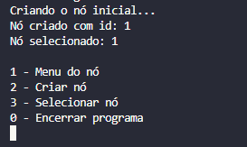
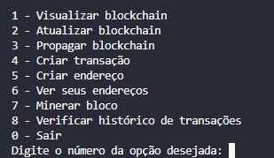

# Documentação

Por motivos didáticos e de aprendizado, esse projeto define alguns valores e facilitadores, afinal, o objetivo do projeto foi fixar o aprendizado da [trilha de aprendizado do Estágio na CompassUOL](https://github.com/AqueleGabrielLa/revisao-estagio-compass) sobre Blockchain. Diante disso, vamos aos detalhes.

## Menus
Ao inicio, somos apresentados ao menu dos Nodes(Nós) da rede, você pode criar novos Nós, selecionando a opção 2, nas quais são já escolhidos após a criação. Você também tem a liberdade de selecionar qualquer Nó criado escolhendo a opção 3. Ao selecionar um Nó, podemos entrar no menu do Node escolhendo a opção 1.

Com um Nó selecionado, somos apresentados as funcionalidades do nó escolhido.

Vamos falar alguns detalhes de cada função:

## Visualizar Blockchain
É mostrado toda a Blockchain que está sendo utilizada pelo nó selecionado. Mostrando os blocos minerados, transações criadas e suas informações gerais.

## Atualizar blockchain
Atualizamos nossa Blockchain para a Blockchain que tiver a cadeia de blocos mais longa. Basicamente, ela percorre cada nó da lista de nós conectados ao nó selecionado e verifica se a cadeia de blocos dela é maior que a sua. Se for maior, ela adota aquela cadeia como a ser trabalhada por ele a partir desse momento.

## Propagar transação
Percorremos a lista de nós conectados e tentamos espalhar a blockchain que estamos trabalhando. Inclusive, se a notar que a blockchain que estamos trabalhando está desatualiza (menor que a de algm nó) a blockchain se atualiza automáticamente com a função da segunda opção do projeto (atualizar blockchain).

## Criar transação
É invocado algumas questões para criar uma transação, é requerido um endereço pro remetente, um endereço pro destinatario, e um valor a ser transferido. Na função, é verificado se são endereços válidos.
Após criada a transação, ela é levada a uma lista de transações pendentes. As transações só vão pra rede após o bloco ser minerado (opção 7).

## Criar endereço
Cria um endereço completamente aleatório em formato hexadcimal com tamanho definido. Os endereços válidos seguem apenas esse padrão.

## Ver seus endereços
Mostra uma lista de endereços registrados no nó, util para copiar e colar na criação de transações.

## Minerar bloco
Cria-se o bloco contendo todas as transações que estavam pendentes, realiza-se o proof of work e é dado recompensas ao primeiro endereço registrado no nó.

## Verificar histórico de transações
É requisitado um endereço, após validação do mesmo, é mostrado todo o histórico do endereço na rede, com seus envios e recibos.

[Códigos](./src/)

[Voltar ao início 🔙](./README.md) 